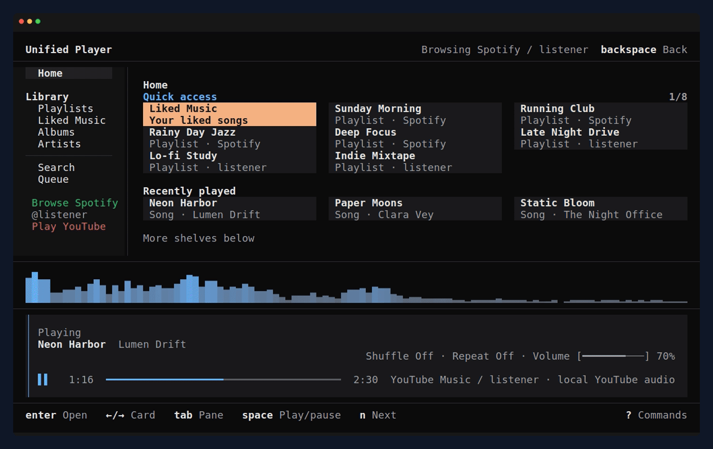
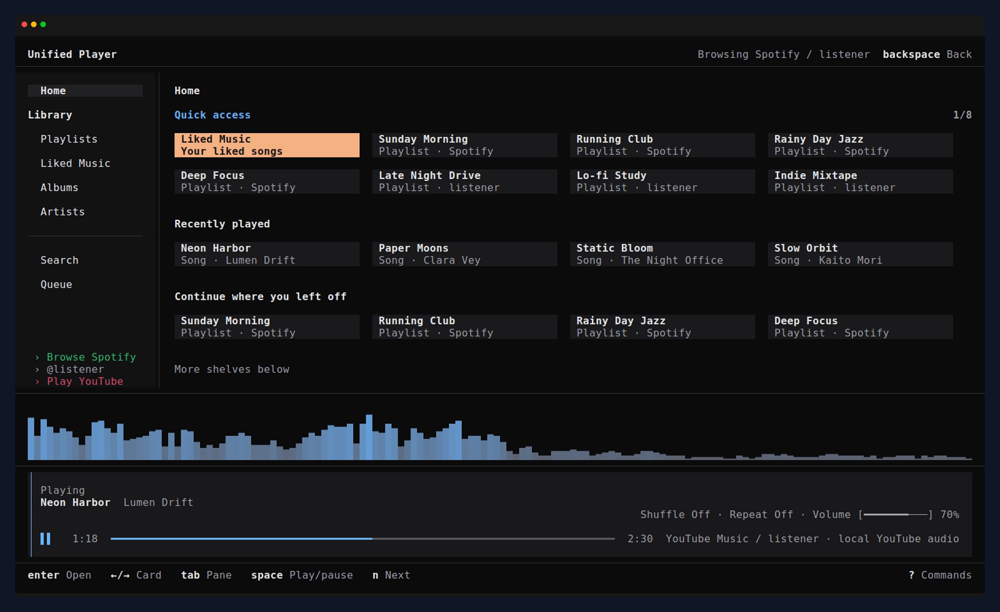

# Unified Player

**Spotify and YouTube Music, in one terminal.** Unified Player is a
keyboard-first music player written in Rust with
[Ratatui](https://github.com/ratatui/ratatui). It plays Spotify through
[librespot](https://github.com/librespot-org/librespot) and YouTube Music
natively, and mixes both in one queue. It uses about 60 MB of RAM while idle
and under 100 MB while playing from Spotify, where Spotify's desktop app uses
about 840 MB idle on the same machine. There is no browser engine inside.

**Spotify playback needs Spotify Premium.** Free accounts can browse and
search, but cannot play music through Unified Player. YouTube Music is
optional and experimental.

This is an early alpha (`0.1.0-alpha.1`): expect rough edges, and see
[platform support](#platform-support) for what has been tried where.

<!-- TODO(2): demo video uploaded through the GitHub editor (user-attachments URL) -->




## What it does

- **Plays music in the terminal.** Unified Player plays Spotify through
  librespot and shows up as a Spotify Connect device, so you can also start
  playback from your phone. YouTube Music streams are decoded locally. Both
  services share one queue, one set of controls, and the same pages.
- **Controls other devices.** Pick a speaker, phone, or another computer with
  `D` and keep controlling it: play, pause, skip, seek, shuffle, repeat,
  volume.
- **Home that remembers.** Quick access to your playlists, recently played
  songs, your top songs, and a *Continue* shelf that picks up where you left
  off. **Show all** opens a shelf as a full list.
- **Library.** Playlists, Liked Songs, saved albums, and followed artists, in
  one table that filters as you type.
- **Search** across songs, artists, albums, playlists, and podcasts on either
  service, with `/` filtering any page in place.
- **Queue.** Add songs from either service with `Z` and see what plays next
  with `z`. A song from YouTube Music can follow one from Spotify.
- **Synced lyrics** that follow playback, from Spotify's own lyrics with
  SimpMusic, LRCLIB, and Musixmatch as fallbacks. An audio visualizer runs
  under them.
- **Cover art** in the prebuilt binaries, or in source builds with the
  `image` feature. It uses the terminal's graphics protocol when there is one
  and falls back to block characters. See the
  [image notes](docs/build-features.md#image).
  <!-- TODO(3): gather current terminal-specific live evidence before naming tested terminals -->
- **50 built-in themes**, previewed live as you move through them with `T`.
  Your own themes override built-in ones with the same name.
- **Every key is configurable**, including vim-style sequences like `g s`.
  Counts work too: `5j` moves five rows.
- **Fits your desktop.** OS media keys and MPRIS on Linux, desktop
  notifications, a daemon mode, and a CLI for scripts and hotkeys.
- **ListenBrainz**, off until you turn it on: import playlists and enrich
  artist pages.
- **Works in small windows.** Down to 60×18, the player bar shrinks and less
  important columns step aside so lists stay readable.

## Install

There are no prebuilt binaries or packages yet; build from source with Rust.

<!-- TODO(4): uncomment once these exist
On Arch Linux, from the AUR:

```bash
yay -S unified-player-bin
```

With Homebrew on macOS:

```bash
brew install bababoyy/tap/unified-player
```

Prebuilt binaries for Linux, macOS, and Windows are on the
[releases page](https://github.com/bababoyy/unified-player/releases).
-->

For a source build, this checkout pins Rust 1.96.1 in `rust-toolchain.toml`.
A minimum supported Rust version has not been established.
<!-- TODO(5): establish an MSRV -->

```bash
cargo install --git https://github.com/bababoyy/unified-player unified-player --locked \
  --features image,notify,fzf
```

The extra features (cover art, notifications, fuzzy search) match the prebuilt
binaries.

On Linux you also need the audio and D-Bus development packages. On Debian or
Ubuntu:

```bash
sudo apt install build-essential pkg-config libssl-dev libasound2-dev libdbus-1-dev
```

on Fedora:

```bash
sudo dnf install gcc pkgconf-pkg-config openssl-devel alsa-lib-devel dbus-devel
```

and on Arch:

```bash
sudo pacman -S --needed base-devel openssl alsa-lib dbus
```

Other audio backends (PulseAudio, JACK, PortAudio, SDL, GStreamer) and
optional features (cover art, notifications, fuzzy search, daemon) are chosen
at build time; see [build profiles](docs/build-features.md).

## Sign in

Start `unified-player`. The setup screen walks you through signing in.

**Spotify** asks for two browser approvals, once per machine. The first is
for your library, search, and playback control (the Web API); the second lets
this computer play audio (librespot). Spotify treats them as two separate apps,
so each needs its own approval.

Every Web API request counts against the quota of a Spotify *client ID*, not
your account. You have two choices in the setup screen:

- **The bundled client ID** (ncspot's) works without any setup, but many apps
  share it, so Spotify often slows it down with "request limit" errors.
- **Your own client ID** gives you a quota of your own. Create an app in the
  [Spotify developer dashboard](https://developer.spotify.com/dashboard), add
  `http://127.0.0.1:8989/login` as a redirect URI, and paste its client ID into
  setup. New apps run in Spotify's development mode, which is enough for your
  own account but cannot open playlists Spotify generates, such as Discover
  Weekly.

**YouTube Music** uses a dedicated browser session that Unified Player opens
for you. See the [YouTube Music setup guide](docs/youtube-auth.md).

Spotify tokens and playback credentials are cached locally under
`~/.cache/unified-player`. YouTube Music credentials and its dedicated browser
profile default to `~/.config/unified-player/youtube`; their paths can be
configured. Saved account slots also retain session files under the
configuration folder. Never share these folders in a bug report.

These defaults are relative to the home directory on Linux, macOS, and
Windows (`%USERPROFILE%` on Windows). Override the configuration root with
`-c` / `--config-folder` and the cache root with `-C` / `--cache-folder`.

## Try it without an account

Every screen runs on built-in sample data, with no sign-in, network, or
playback, and without touching your settings:

```bash
unified-player demo screen home --scenario showcase --interactive
```

Move with the arrow keys, open a playlist with `Enter`, try themes with `T`,
and quit with `q`.

## Account safety

**Spotify.** Sign-in happens on Spotify's own pages, and audio plays at the
quality your Premium plan includes through
[librespot](https://github.com/librespot-org/librespot), the same library
spotifyd and ncspot use. Unified Player does not save songs, remove ads,
bypass DRM, or unlock Premium features, and [CONTRIBUTING.md](CONTRIBUTING.md#out-of-scope)
rules out changes that would. Spotify does not endorse third-party clients.

**YouTube Music** has no public playback API. Unified Player uses the same web
interfaces YouTube's own apps use, which may break without notice and may not
be allowed by YouTube's terms. Use it at your own risk.

## Keyboard shortcuts

| Key | Action |
| --- | --- |
| `↑` `↓` / `k` `j` | Move up / down |
| `←` `→` | Move between cards on Home |
| `Enter` | Open or play the selection |
| `Space` | Play / pause |
| `n` / `p` | Next / previous song |
| `/` | Filter the current page |
| `g s` | Search |
| `Z` / `z` | Add to queue / show the queue |
| `T` | Change theme |
| `D` | Pick a Spotify Connect device |
| `g m` | Switch between Spotify and YouTube Music |
| `?` | All commands |
| `q` | Quit |

Every binding can be changed; see the [command list](docs/commands.md#keys)
and [key maps](docs/config.md#keymaps).

## Controlling it from outside

On Linux, media keys and tools like `playerctl` see Unified Player through
MPRIS. On every platform, the `unified-player` command talks to the running
app, which makes it easy to bind to a launcher or a hotkey:

```bash
unified-player playback play-pause
unified-player playback next
unified-player get key playback
unified-player like
```

With the optional `daemon` feature compiled, start it with `--daemon` to keep
playing with no window open on Linux or macOS. Windows is unsupported; macOS
daemon builds must omit `media-control`. See the
[daemon notes](docs/build-features.md#daemon).

See the [CLI reference](docs/commands.md#command-line) for every command.

## Settings

Settings live in `~/.config/unified-player/app.toml`, themes in `theme.toml`,
and key maps in `keymap.toml`. [`examples/app.toml`](examples/app.toml) lists
every option with its default. See [configuration](docs/config.md).

## Platform support

| | Linux | macOS | Windows |
| --- | --- | --- | --- |
| Spotify playback on this computer | Tested | Untested | Tested |
| Spotify Connect (control other devices) | Untested | Untested | Tested |
| YouTube Music playback | Broken (403) <!-- TODO(9) --> | Untested | Tested |
| Media keys | MPRIS, untested | Off by default | Off by default |
| Daemon mode | Requires `daemon` feature | Requires `daemon`, without `media-control` | Unsupported |

<!-- TODO(9): fill in after live passes; Windows rows come from docs/support-matrix.md -->
"Tested" means someone played music with a release build on that platform.
The [support matrix](docs/support-matrix.md) has the details.

## How it is built

- `unified-player/src/client/`: Spotify and YouTube Music requests, sign-in,
  and the background task that runs them.
- `unified-player/src/streaming.rs`, `streaming/`: librespot and native audio
  playback.
- `unified-player/src/state/`: shared app state: library, player, queue, and UI.
- `unified-player/src/event/`, `ui/`: key handling and drawing, per page and
  popup.
- `unified-player/src/cli/`: the socket the `unified-player` command speaks.

`scripts/dev.sh verify` runs formatting, tests, and Clippy the same way CI does.
`demo screen <page> --size WxH` renders any page offline, which is how the
screenshots above are made.

## Documentation

- [Configuration](docs/config.md): settings, themes, key maps, ListenBrainz
- [Commands and key bindings](docs/commands.md): every key, action, and CLI command
- [Support matrix](docs/support-matrix.md): what works on which service and platform
- [YouTube Music setup](docs/youtube-auth.md)
- [Build features](docs/build-features.md): optional features and audio backends
- [Diagnostics and privacy](docs/diagnostics-and-privacy.md): what to share in a bug report

## Contributing

Read [CONTRIBUTING.md](CONTRIBUTING.md) before opening an issue or pull
request. Report security issues privately as described in
[SECURITY.md](SECURITY.md). Never post tokens, cookies, or browser profiles in
an issue; [diagnostics and privacy](docs/diagnostics-and-privacy.md) explains
what to share instead.

## Acknowledgements

Unified Player started as a fork of
[spotify-player](https://github.com/aome510/spotify-player) by aome510. It uses
[librespot](https://github.com/librespot-org/librespot),
[rspotify](https://github.com/ramsayleung/rspotify),
[Ratatui](https://github.com/ratatui/ratatui), and themes adapted from
[OpenCode](https://github.com/anomalyco/opencode).

Unified Player is an independent project and is not affiliated with Spotify
or YouTube. Spotify is a trademark of Spotify AB; YouTube is a trademark of
Google LLC.

Licensed under the [MIT License](LICENSE). The upstream copyright notice is
retained.
